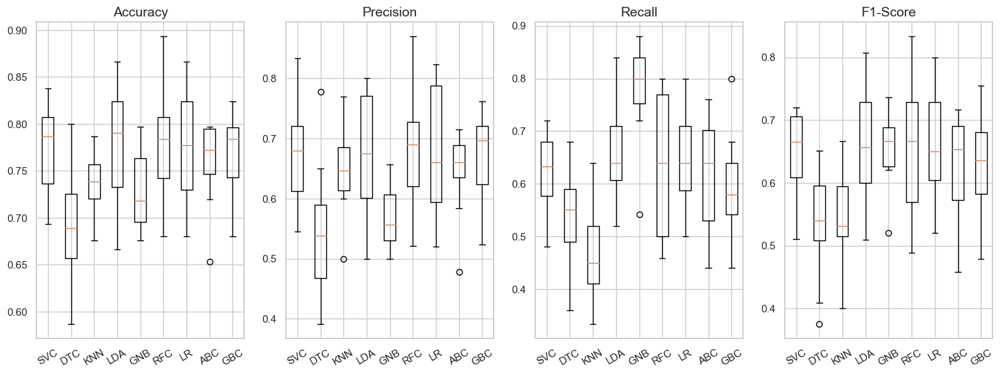
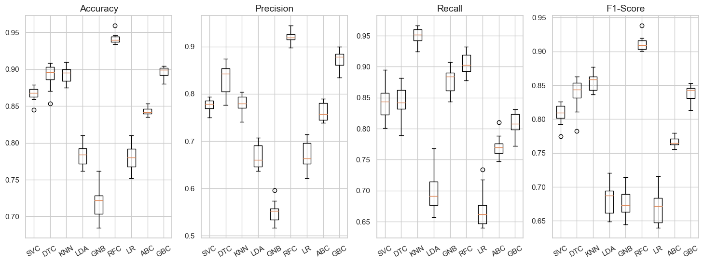

# Brain Stroke Prediction
A stroke is a medical condition in which poor blood flow to the brain causes cell death [1]. This is basically a classification problem. The aim of this study is to check how well it can be predicted if patient will have barin stroke based on the available health data such as glucose level, age, gender etc.

We checked the [data](https://github.com/muscak/Brain-Stroke-Prediction/tree/main/Data) and performed some explanotary data analysis first, then processed the data as needed. Fortunately there was no `Null` values in any of the features. One of the major challenges that we faced was that the data was imbalaced. The ratio of the people who had no stroke was 96.30% and the people who had stroke was 3.70%. The gap between these two classes was huge. 

  

Since the false negatives (*predicting someone as won't have stroke but he/she has it*) is far dangerous than false negatives (*predicting someone as he/she will have stroke but he/she hasn't it*) it's better to try to maximize the **Recall**.

$$Recall = \frac{\text{True Positives}}{(\text{True Positives} + \text{False Negatives})}$$

After removing the outliers and checking the distribution of the numeric and categorical features, we noticed that the number of observations (data points) with stroke history was really low which we suspect that the ML algorithms would not generalize properly. That's why we decided first to compare the learning performance of the ML algorithms on datsets with and wihtout outliers, then apply the `imblearn` techniques. We compare the below algorithms:

1. Support Vector Classifier (SVC)
2. Decision Tree Classifier (DTC) 
3. $k$-Nearest Neighbor ($k$-NN)
4. Linear Discrimenant Analyses (LDA)
5. Gaussian Naive Bayes (GNB)
6. Random Forest Classifier (RFC)
7. Logistic Regression (LR)
8. AdaBoost Classifier (ABC)
9. Gradient Boosting Classifier (GBC)

As you may guess, the generilization ability of the algorithms with outliers was better.

Then we used `RandomUnderSampler` function of `imblearn` library with 0.5 `sampling_strategy` to make the labels more balanced. We checked the performance of S algorthims with the given dataset by using 10-fold cross validation. We preferred stratified strategy as the dataset was in imbalanced state.

  

As you can see from the above image, the best mean Recall score with the lowest standard deviation was provided by GNB.

As as next step, we over sampled the data using `SMOTE` [2] function of `imblearn` library and check the performance of above mentioned algorithms.

  

As you can see from the above image, now KNN provides the best mean Recall score which is almost more than 0.95 with the lowest standard devidation.However, considering that we used *k nearest minority class neighbors* to synthetically generate data points, it seems reasonable. That's why it's hard to rely on this model for real-world implementation. Also adding more data points increased the model evaluation time dramatically which is worth to mention at this point.

We decided to continue with the GNB with under-sampled dataset for hyperparameter tuning. 

After tuning the hyperparameters of GNB we managed to achieve 0.71 Recall score. There are still some room for the improvement. We can enrich the dataset by collecting some other data points from other patients or adding extra feature such as weekly alcohol consumption, stroke history in the family, diet habits etc. Apart from enriching the dataset, we can also utilize the other algorithms such as XGBoosting.S

## References
[1] [Stroke](https://en.wikipedia.org/wiki/Stroke)
[2] [SMOTE for Imbalanced Classification with Python](https://machinelearningmastery.com/smote-oversampling-for-imbalanced-classification/)
