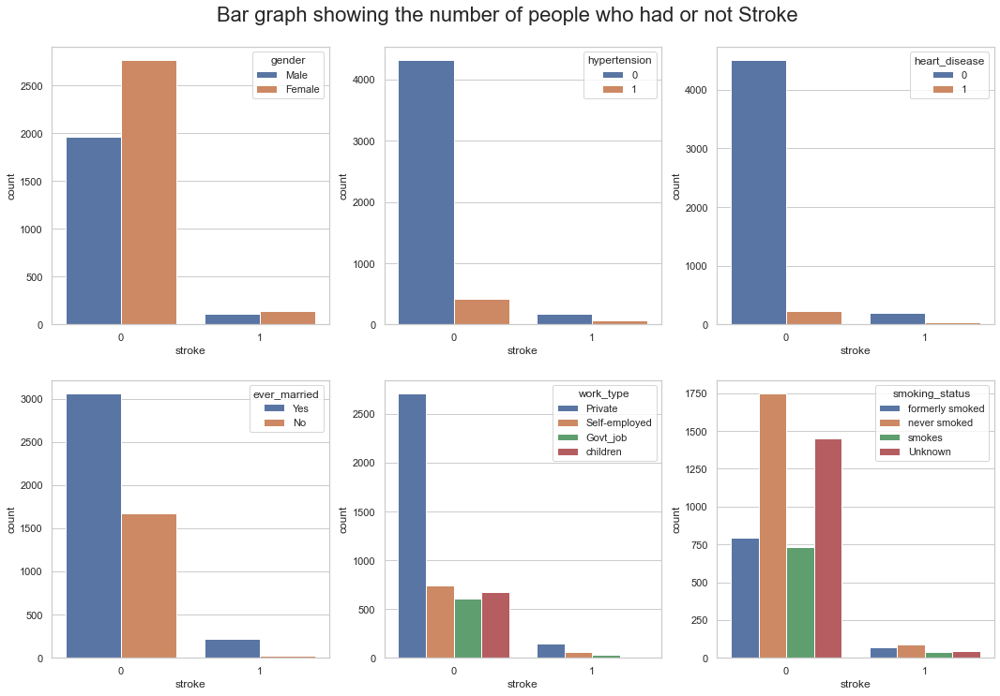
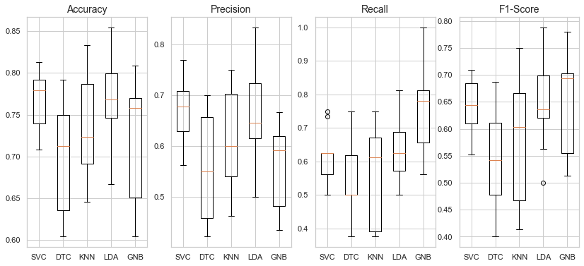
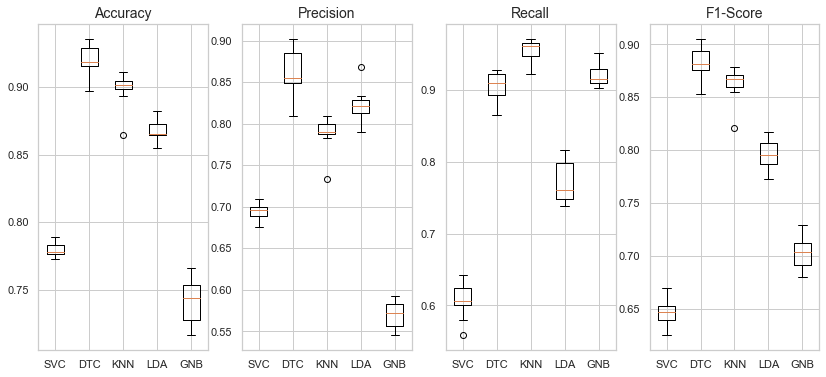

# Brain Stroke Prediction
This is basically a classification problem. The aim of this study is to check how well it can be predicted if patient will have barin stroke based on the available health data such as glucose level, age, gender etc.

We checked the [data](https://github.com/muscak/Brain-Stroke-Prediction/tree/main/Data) and performed some explanotary data analysis first, then processed the data as needed. Fortunately there was no Null values in any of the features. One of the major challenges that we faced was that the data was imbalaced. The ratio of the people who had no stroke was 96.30% and the people who had stroke was 3.70%. The gap between these two classes was huge. 

  

After removing the outliers and checking the distribution of the numerical features, we used `RandomUnderSampler` function of `imblearn` library with 0.5 `sampling_strategy` to make the labels more balanced. We checked the performance of Support Vector Classifier (SVC), Decision Tree Classifier (DTC), $k$-Nearest Neighbor ($k$-NN), Linear Discrimenant Analyses (LDA) and Gaussian Naive Bayes (GNB) algorthims with the given dataset by using 10 $k$-fold cross validation. We preferred stratified strategy as the dataset was in imbalanced state.

  

As you can see from the above image, the best mean accuracy score (76.9%) with the lowest standard deviation (0.3%) was provided by SVC.

As as next step, we over sampled the data using `SMOTE` function of `imblearn` library and check the performance of above mentioned algorithms.

  

As you can see from the above image, now DTC provides the best mean accuracy score %91.9 with the lowest standard devidation of 0.1%. This also showed that the amount of the data wasn't enough in the under sampled model to train the algorithms properly.

After preparing the data, we'll evaluate the performance of different algorithms and tune the hyperparameters of the one which is the most promissing. Finally we'll perform a prediction on the test data to check the overall performance of the chosen algorithm.
